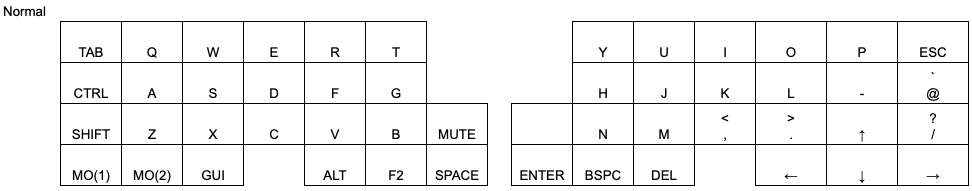
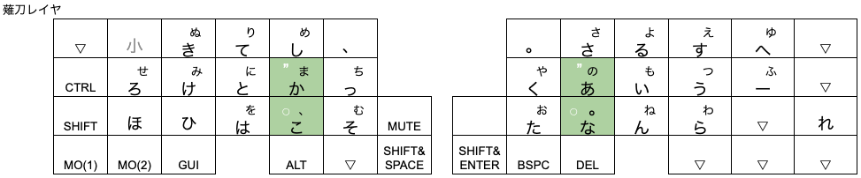
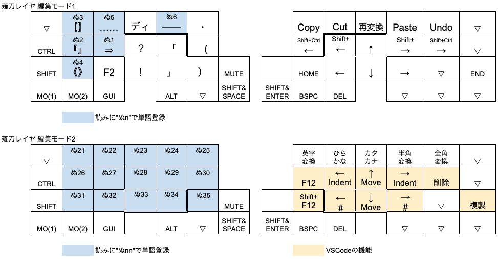

# Cornix版 ZMK 薙刀式

**eswaiさんの「ZMK 薙刀式」 [eswai/zmk-naginata](https://github.com/eswai/zmk-naginata) をフォークしてCornix専用にカスタマイズしました。**  
 また、本リポジトリは、[wataruw/zmk-keyboard-cornix](https://github.com/wataruw/zmk-keyboard-cornix) とセットで使用します。

---

> 【eswaiさんのREADME.mdより】  
> ZMK Firmwareで薙刀式かな入力を実現します。  
> 薙刀式は大岡俊彦さんが考案された、かな入力方式です。  
> [カナ配列【薙刀式】(カタナ式ファミリー)](http://oookaworks.seesaa.net/article/456099128.html)

## Cornix版 ZMK 薙刀式のファームウェアに関して

Cornix版 ZMK 薙刀式のファームウェアは、本リポジトリではなく、[wataruw/zmk-keyboard-cornix](https://github.com/wataruw/zmk-keyboard-cornix) のGitHub Actionsから、本リポジトリがリンクされることでCornix＋薙刀式のファームウェアが生成されます。  
Cornix版 ZMK 薙刀式のファームウェアは、**本リポジトリ単独では生成できません**のでご注意ください。

- GitHub Actionsとは、GitHubが用意するBuild環境です。自分でZMKのBuild環境を用意する必要はありません。
- CornixはRMKファームウェアが組み込まれた状態で製品出荷されています。現時点でCornixのRMKソースは公開されていません。
- 代わりにCornixで動作するZMKファームウェアが有志により公開されています。 ⇒ [hitsmaxft/zmk-keyboard-cornix](https://github.com/wataruw/zmk-keyboard-cornix)
- [wataruw/zmk-keyboard-cornix](https://github.com/wataruw/zmk-keyboard-cornix) は、[hitsmaxft/zmk-keyboard-cornix](https://github.com/wataruw/zmk-keyboard-cornix) をフォークしています。
- [wataruw/zmk-naginata](https://github.com/wataruw/zmk-naginata) は、[eswai/zmk-naginata](https://github.com/eswai/zmk-naginata) をフォークしています。
- [wataruw/zmk-keyboard-cornix](https://github.com/wataruw/zmk-keyboard-cornix) + [wataruw/zmk-naginata](https://github.com/wataruw/zmk-naginata) で、「Cornix版 ZMK 薙刀式」が成り立っています。先達に感謝！

## キーマップに関して

Cornix＋薙刀式のキーマップは、[wataruw/zmk-keyboard-cornix](https://github.com/wataruw/zmk-keyboard-cornix)のconfig/cornix.keymapです。本リポジトリのキーマップは使用しません。(後で消しておきます)  
レイヤー3に薙刀式のキーマップが定義されています。  
**&ng** xx 定義を本リポジトリのプログラムが読み込み、動作します。  

- ZMKファームウェアではVialは使えません(自分が知らないだけかも)。ZMK Studioというサイトもありますが、今のところ機能が少なくVialほど使えないので、ここでは触れません。( ⇒ ここら辺がZMKファームウェアがCornixで採用されなかった理由ですかね？？)
- 定義は難しくないので、一緒にファームウェア生成にトライしてみませんか？簡単ですよ！

## つまり本リポジトリは……

薙刀式の動作のみを定義しています。
eswaiさんの「ZMK 薙刀式」は大岡さんのキーマップを忠実に実装なさっていますので、まずはeswaiさんオリジナルをリンク先に変更(戻)して、慣れて頂いても良いです。
本リポジトリでは、Cornixのキー配列を活かして、以下の修正をしています！！

### Cornixキー配列の特徴 (他の自キでもありますが……)

- 親指に左右3つキーがある
- カーソルキーが独立して配置可能

### Cornix版 ZMK 薙刀式の特徴

#### 薙刀レイヤ

- 左側のキーボード親指部分、1番内側のキーをShft&Spaceキーに割り当てています。
- 右側のキーボード親指部分、1番内側のキーをShft&Enterキーに割り当てています。
- 右側のキーボード親指部分、Shft&Enterキーの右側のキーにBackSpaceキーを割り当てています。
  - 薙刀式では、Uキーの表面にBackSpaceキーが割り当ててありますが、さらに押しやすい位置に独立したキーとしてBackSpaceキーを割り当てたので、Uキーの裏面の「さ」を表面に持って来ました。
  - 当初は裏面の「さ」は消していましたが、既に裏面の「さ」に慣れていたのか、よく誤爆したので裏面の「さ」はそのままにしています。
- 右側の小指、薬指で独立してカーソルキー操作ができるので…… (私はo51goでも同じ位置にカーソルキーを配置していました)
  - TとYキーの変換・カーソル用の横書き時：上下(↑↓)、縦書き時：右左(←→)を廃止し、Tキーに「、+ 確定」を、Yキーに「。+ 確定」を割り当てました。
  - Vキーの裏面は「、+ 確定」のまま、Mキーの裏面も「。+ 確定」のまま残しています。
  - 文章入力中はなかなかTとYキーまで指が「のびない」というか、「遠い」感じがしています。多分、指が短いのでしょう。一息着くと、TとYキーまでいってもリズムが壊れないかな…… 個人の感想です。

#### 薙刀編集モード

- 薙刀編集モードの「固有名詞モード」は未実装です
- 編集モード1、2の右手は入れ替えるかも……
- 書きかけです…… すみません……

## さらにカスタマイズをしたいなら

[wataruw/zmk-keyboard-cornix](https://github.com/wataruw/zmk-keyboard-cornix) と [wataruw/zmk-naginata](https://github.com/wataruw/zmk-naginata) をそれぞれフォークしてください。
